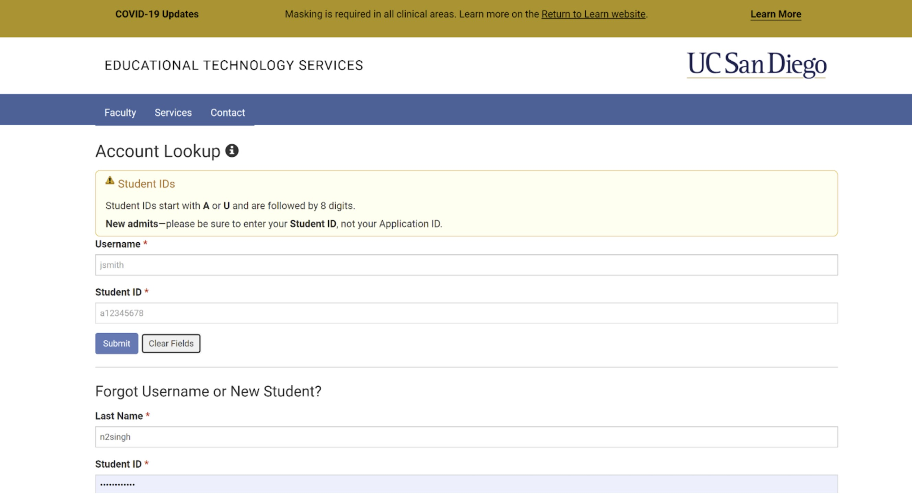
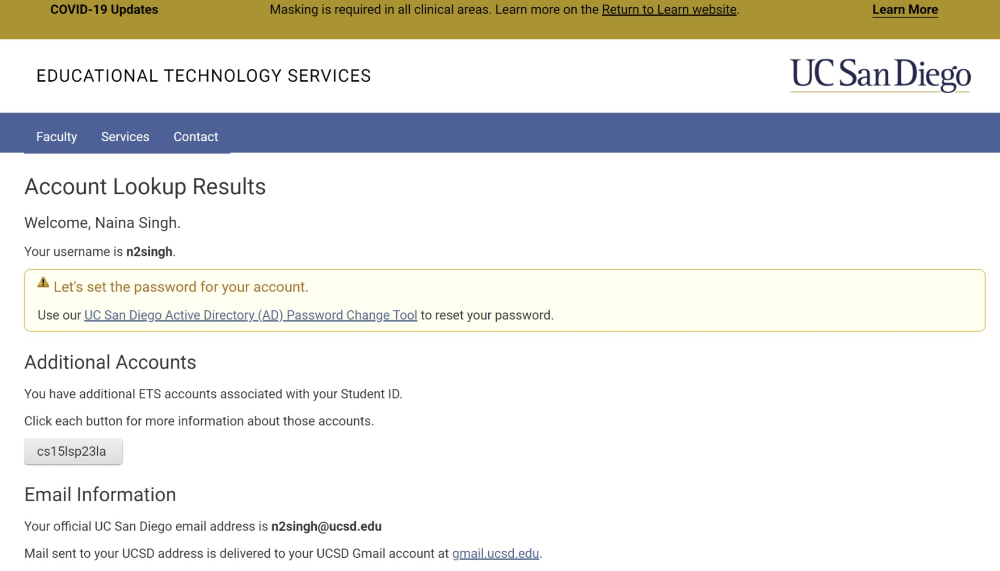
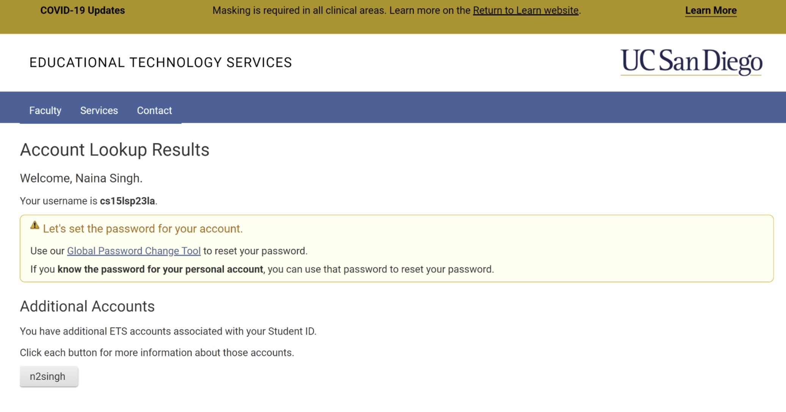
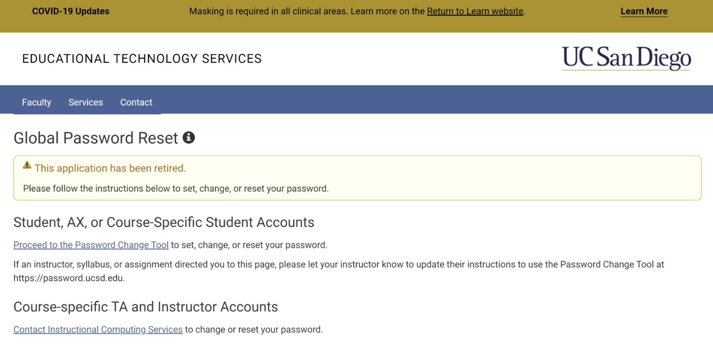
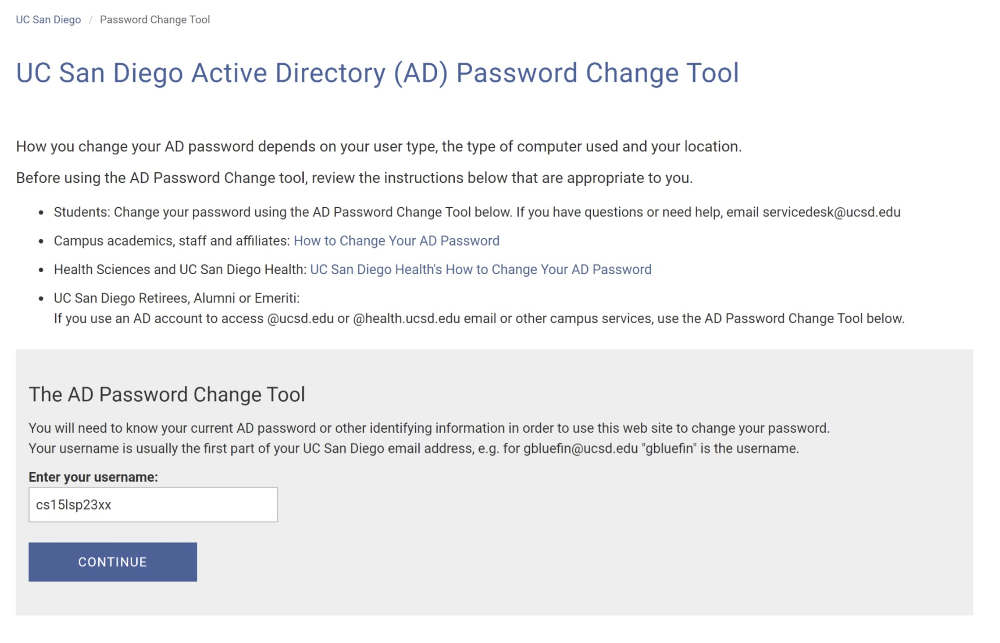
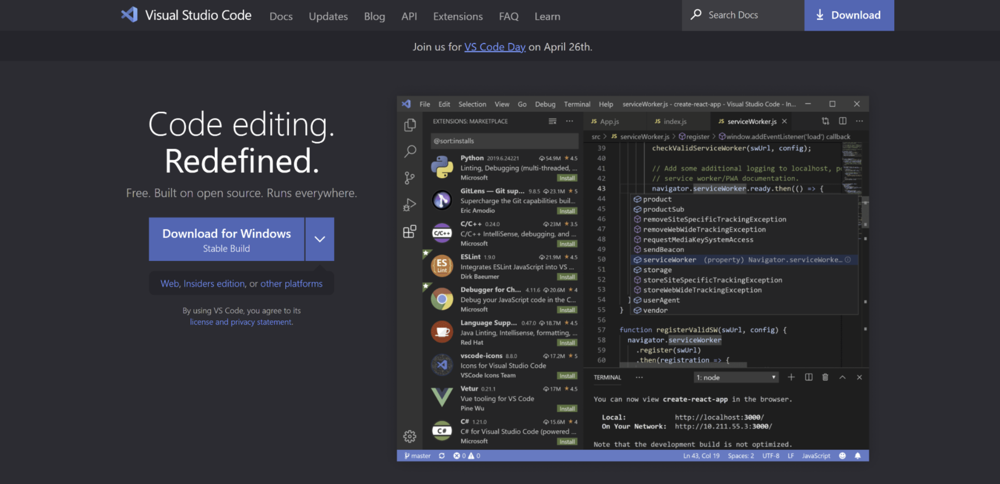
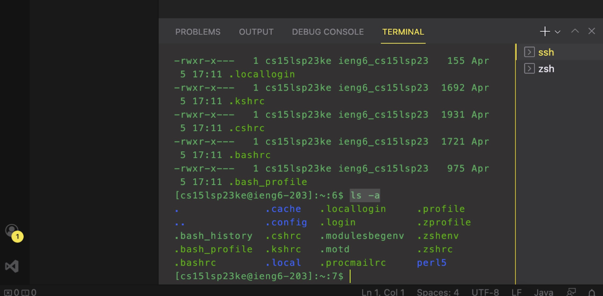

# **Lab Report 1**
---
For the first part of the lab, we must look up our course-specific account for the class CSE 15 L using the link 
[Link](https://sdacs.ucsd.edu/~icc/index.php)
You will look up your account using your:
1. TritonLink username as your username
2. Your PID as your password



---

Once you login you will click the button that says `cs15lsp23xx`
The `xx` is unique to your account with different letters there


---

Copy the same `cs15lsp23xx` username at the top of the screen and click the link that says ***UC San Diego Active Directory (AD) Password Change Tool***


---

Then click the link that says ***Proceed to the Password Change Tool***


---

When you click the link you will see this page


---

Enter your username `cs15lsp23xx` with your specific two letters `xx` replacing the end
You will see this page next


---

Click the link to reset the account and do the Duo Multi-Factor Authentication
You will then see this page 


---

Confirm if it is your email address, then you will be sent an email with instructions to reset your password
You’re all set here!

---

## Installing VScode
To download VSCode you must go to the link [Link](https://code.visualstudio.com/) and click “Download for Windows” then click the download at the bottom of your screen when it is finsihed

---





---

Once downloaded you can open the app and the screen will look like this


---

## Remotely Connecting
- Before we remotely connect, we need to install `git` using the link [Link](https://gitforwindows.org/)


---

In VSCode, open a terminal using the terminal button at the top of the page or `Ctrl + ``
Open the command palette using `Ctrl + Shift + P` and type in `Select Default Profile`


---

Select `Git Bash` from the options
Then click the `+ icon` at the bottom right corner
The terminal will now be in Git Bash and should look like the green, purple, and yellow text in the terminal


---

Now that `Git` is installed, we can lookup our course specific account by typing the line 
```
$ ssh cs15lsp23xx@ieng6.ucsd.edu
```
with `xx` replacing the letters that are specific to your account (Do not type the $, it is just a convention)


---

You will then be prompted to type in your password that you reset from before (it will not show you are typing it in)
If you are logging into the account for the first time you may receive a message that looks like

```
The authenticity of host 'ieng6.ucsd.edu (128.54.70.227)' can't be established.
RSA key fingerprint is SHA256:ksruYwhnYH+sySHnHAtLUHngrPEyZTDl/1x99wUQcec.
Are you sure you want to continue connecting (yes/no/[fingerprint])?
```


Reply `yes` and then you will see something like this in the terminal, you are logged in!


---

*Before, during lab, my terminal would show this after logging in and the TA told me that it was an issue with the server, this has now been resolved*


---

## Trying Some Commands
---

We can now try some commands!
Here is a specific list of helpful commands to try

```
- cd ~
- cd
- ls -lat
- ls -a
- ls <directory> where <directory> is /home/linux/ieng6/cs15lsp23/cs15lsp23abc, where the abc is one of the other group members’ username
- cp /home/linux/ieng6/cs15lsp23/public/hello.txt ~/
- cat /home/linux/ieng6/cs15lsp23/public/hello.txt
```

Some examples
    
Command → 
```
“pwd”
```

This command printed the directory I was working in at the time. This directory is specific to me because cs15lsp23la is my own username (and therefore my own private directory), but /home/linux/ieng6/cs15lsp23/ would be the same home directory as other people in the group because we’re all working/connected on the same server.


---
  
Command → 
```
-lat 
```
this listed the files in the current working directory

    
---

Command → 
```
ls -a 
```
This command shows different files, including hidden ones such as login, bash, config and profile.
    
    


