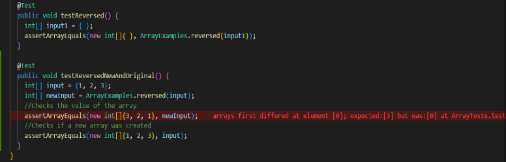
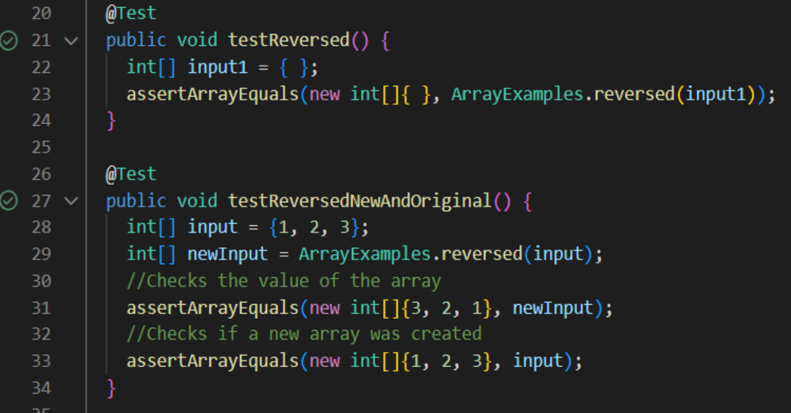

# **Lab Report 2**
---
There are three parts to this lab.
## Part 1
---
The first part is to write a web server called `StringServer` that should keep track of a single string that gets added to by incoming requests.
Using the given code from lab two and my own implementation, I have the code for `StringServer.java` below

```
//Part 1 of The Lab 

import java.io.IOException;
import java.net.URI;
import java.util.ArrayList;

class Handler implements URLHandler {
    ArrayList<String> arr = new ArrayList<>();
    
    public String handleRequest(URI url) {
        if (url.getPath().equals("/")) {
            return makeString(arr);
        }
        else if (url.getPath().equals("/add-message")) {
            String[] parameters = url.getQuery().split("=");
            arr.add(parameters[1]);
            return makeString(arr);
        }
        return "404 Not Found!";
    }

    // concatenate a new line (\n) and the string after = to the running string, 
    //and then respond with the entire string so far

    public String makeString(ArrayList<String> arr) {
        String str = "";

        for (int i = 0; i < arr.size(); i++) {
            str = str + arr.get(i) + "\n";
        }

        return str;
    }
}

//Similar to given code from NumberServer.java

public class StringServer {
    public static void main(String[] args) throws IOException {
        if(args.length == 0){
            System.out.println("Missing port number! Try any number between 1024 to 49151");
            return;
        }

        int port = Integer.parseInt(args[0]);

        Server.start(port, new Handler());
    }
}
```
---
When ran with `Server.java`, `StringServer.java` creates an online server that is able to store and display strings. 
Inputting specific paths allows strings to be added and displayed on the site.

Here are two screenshots using `/add-message`


We can see here that the first image will store the word "Naina" until the server restarts.
In image 2, I added the word "Banana" which appears there in addition to my name.

---

**Explanation**

Which methods in your code are called?
What are the relevant arguments to those methods, and the values of any relevant fields of the class?
How do the values of any relevant fields of the class change from this specific request? If no values got changed, explain why.

- The main method's parameter "args" is the port of the server. The method starts by checking if a port was given. If it wasn't, it will display an error and prompt the host to try again. Then, the first arg is parseInted to an Integer type so it can be used as the port. Once the port is processed, the server is started through the Server.java file.
- Above is the Handler class, which deals with the url input. The class begins by initializing a string ArrayList called arr. arr is used to store all inputs by the user
- The first method in Handler is handleRequest. This method is what goes through the url input to determine what action to take.

1. If there is no added path, it will return the current state of arr.
2. If the path is "/add-message", it will read the query and add the string after the "=" to arr. Then it will return the current state of arr.
3. If the path is invalid, return an error "404 Not Found!"
4. As you might observe, there is a method called makeString included everytime arr is returned.

- makeString does as it sounds, it formats arr into a string. It does so by going through each element of the ArrayList and adding it to a string, with newlines between each element. This is necessary because the handleRequest method's return type is String and arr is an ArrayList.

---

## Part 2
---
For part 2, we need to choose one of the bugs from lab 3.

--- 
The issue I am going to address is from `ArrayExamples.java`, which consisted of two buggy methods. One of which was reverse.

```
static int[] reversed(int[] arr) {
    int[] newArray = new int[arr.length];
    for(int i = 0; i < arr.length; i += 1) {
      arr[i] = newArray[arr.length - i - 1];
    }
    return newArray;
  }
```

This method is supposed to take an array `arr` and return a new copy with it's contents in reverse order. 
- For example, an `arr` of {1, 2, 3} will return a new `arr` {3, 2, 1}. 
When tested with JUnit, it passed.

```
@Test
  public void testReversed() {
    int[] input1 = { };
    assertArrayEquals(new int[]{ }, ArrayExamples.reversed(input1));
  }
```

Although the test passed, it has a major bug.
For example, if `arr` was {1, 2, 3}, it returned {0, 0, 0} when the expected is {3, 2, 1}.



The photo above shows the original JUnit + my own, checking the error in 2 ways. 
1. Check the new `arr`. It should have been {3, 2, 1} but instead was {0, 0, 0}. 
2. Check the original `arr`. Since the `reversed` method was supposed to create a new array, the original shouldn’t have been tampered with. Checking 'arr' after using the `reversed` method, it ended up becoming {0, 0, 0} when it should have been {1, 2, 3}.

The error here is that the code mixed up the assignment in the for loop. 
The method assigns the new empty newArray’s values to the old arr, causing both of the arrays to become empty.

Original method with error:

```
static int[] reversed(int[] arr) {
    int[] newArray = new int[arr.length];
    for(int i = 0; i < arr.length; i += 1) {
      arr[i] = newArray[arr.length - i - 1];
    }
    return newArray;
  }
```

Method rewritten and fixed:

```
static int[] reversed(int[] arr) {
    int[] newArray = new int[arr.length];
    for(int i = 0; i < arr.length; i += 1) {
      newArray[i] = arr[arr.length - i - 1]; //newArray is swapped with arr
    }
    return newArray; //newArray is returned instead of arr
  }
```

With the fixed code, the method runs as expected and both JUnit tests are passed. 
The switch of the two variables in the for loop and swapping the return from `arr` to `newArray` fixed `arr`'s values to be assigned into `newArray` in reverse order, creating a reversed copy without effecting the original.




