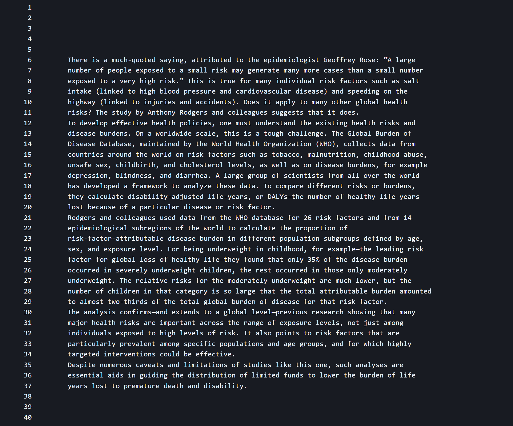
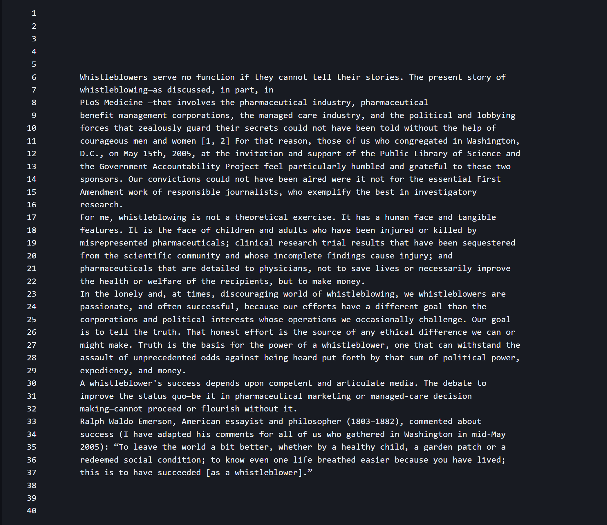
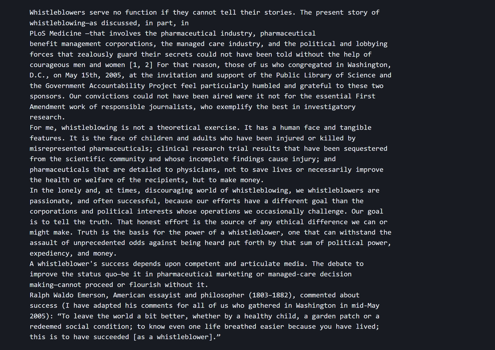
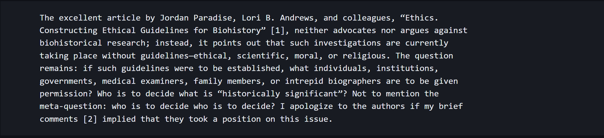
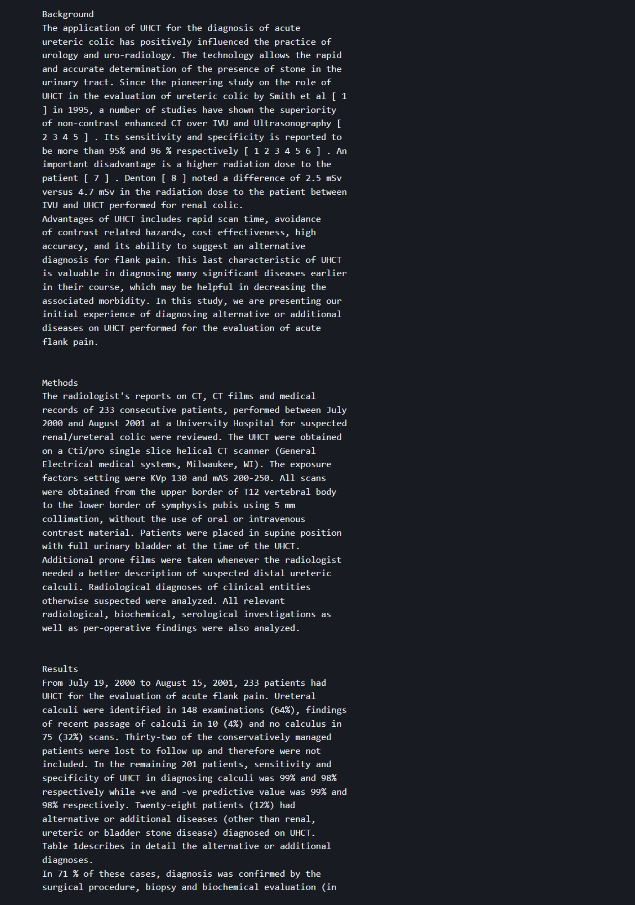
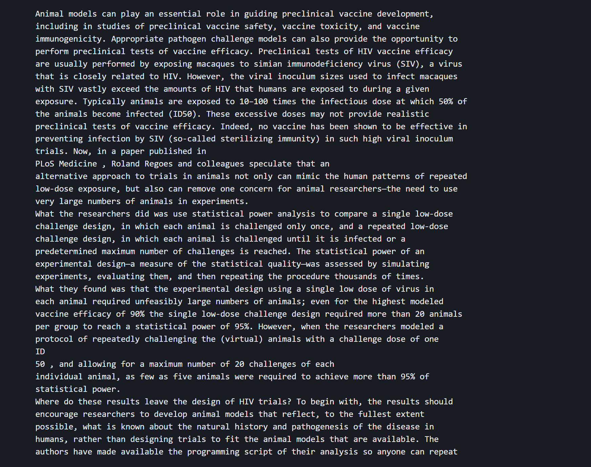
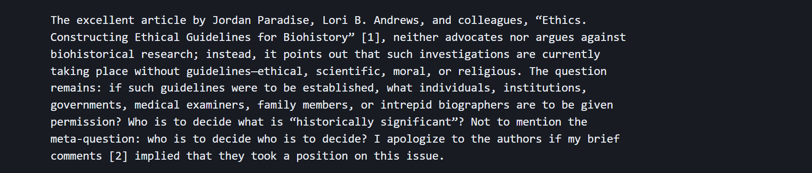
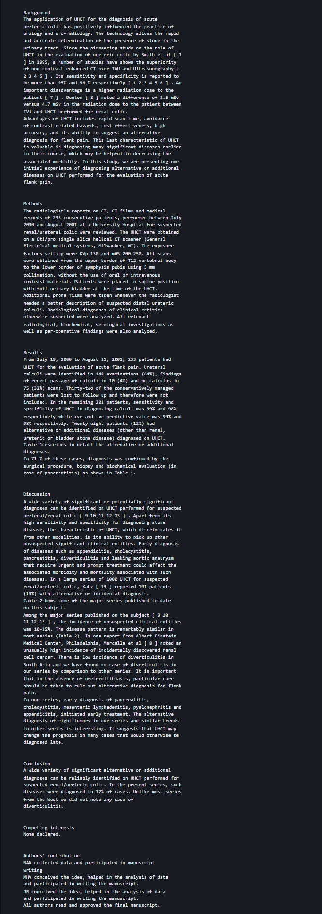

# Lab Report 3
---
- For this lab, I will be focusing on the `less` command
---
4 interesting command-line options I will be using are:

- `-N`
- `-F`
- `-X`
- `-g`

---
## -N: Line Numbers

`less -N plos/pmed.0010029.txt`

`less -N ./technical/plos/pmed.0020281.txt`

- The `-N` option for less displays the line number next to all the lines in the text file. This is useful if you are referring to a specific line number that you might need and useful for navigating both large and small files.

Citation: [How to Use the less Command in Linux with Examples](https://phoenixnap.com/kb/less-command-in-linux#:~:text=Note%3A%20By%20default%2C%20searching%20in,phrase%20and%20see%20the%20results)

This site stated, "Use the -N option to display the specified text file with line numbers. Displaying line numbers is useful for code reviews or paired programming because they make it easier to locate a specific issue."

---

## -F: Merges Empty Lines

`less -F ./technical/plos/pmed.0020281.txt`

`less -F ./technical/plos/pmed.0020191.txt`

- The `-F` option views the contents of a file and quits out of the less command if the contents fit on the screen. This is useful when you are trying to view a file real quick without having to quit out of the less command.

Citation: [less(1) — Linux manual page](https://man7.org/linux/man-pages/man1/less.1.html)

This site stated, "-F or --quit-if-one-screen Causes less to automatically exit if the entire file can be displayed on the first screen."

---

## -X: Does Not Clear Screen

`less -X ./technical/biomed/1471-2490-3-2.txt`

`less -X ./technical/plos/pmed.0020258.txt`

- The option `-X` allows us to view some parts of the file without clearing the screen. This makes it easier to view files simultaneously.

Citation: [less(1) — Linux manual page](https://man7.org/linux/man-pages/man1/less.1.html)

This site stated, "-X or --no-init Disables sending the termcap initialization and deinitialization strings to the terminal.  This is sometimes desirable if the deinitialization string does something unnecessary, like clearing the screen."

---

## -g:

`less -g ./technical/plos/pmed.0020191.txt ./technical/plos/pmed.0020281.txt`

`less -g ./technical/biomed/1471-2490-3-2.txt ./technical/biomed/rr196.txt`

- The `-g` option will display the file that comes first between the arguments that you put at the command line. This is useful when you want to know what file comes first.

Citation:  [less(1) — Linux manual page](https://man7.org/linux/man-pages/man1/less.1.html)

This site stated, "-g or --hilite-search Normally, less will highlight ALL strings which match the last search command.  The -g option changes this behavior to highlight only the particular string which was found by the last search command.  This can cause less to run somewhat faster than the default."

---
