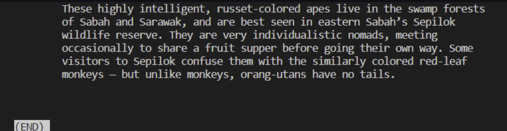
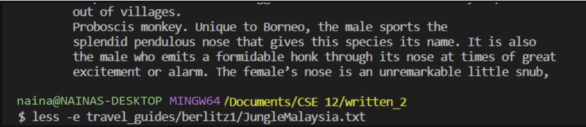
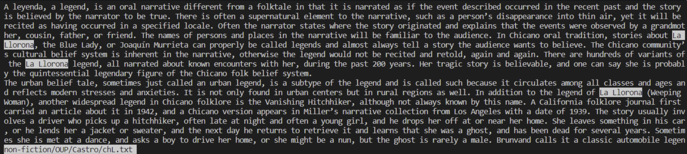
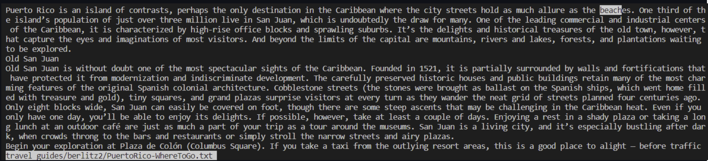
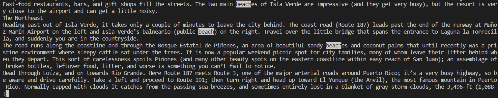
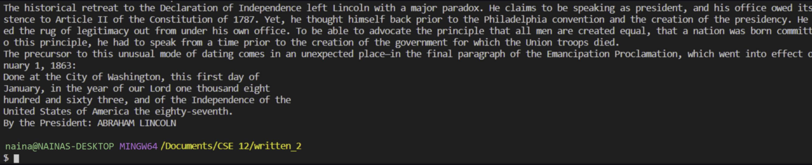
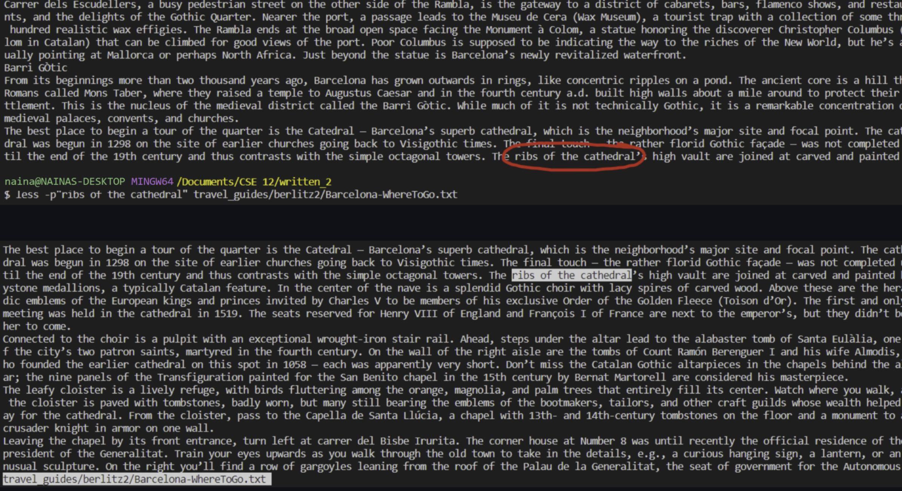
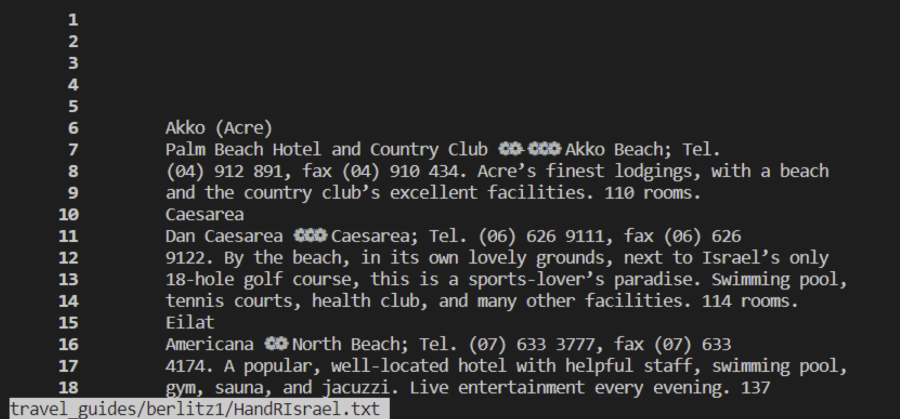
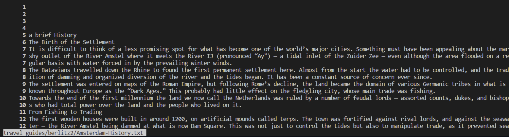

# Lab Report 3
---
Directions: Consider the commands less, find, and grep. Choose one of them. Online, find 4 interesting command-line options or alternate ways to use the command you chose. Show each example as a code block that shows the command and its output, and write a sentence or two about what it’s doing and why it’s useful. That makes 8 total examples, all focused on a single command. There should be two examples each for four different command-line options. Along with each option/mode you show, cite your source for how you found out about it as a URL or a description of where you found it.
For this lab, I will be using the `less` command.
I learned about the less command with this website [How to Use the less Command in Linux with Examples](http://a.com](https://phoenixnap.com/kb/less-command-in-linux)
---
## Auto Exit: `-e`
--- 
The first one I looked into was `-e`. and it is convenient for reading multiple connected articles.
using `less <file>`, the end of a file is signified by an (END) placed after all the document's contents have been explored. To exit, you would have to press `q`.
The end of a file looked like this:



If you use less `-e <file>`, it automatically ends the command after the file's contents have been explored. It does not show the end symbol
Here is an example using the same file in the `less <file>` example above.



There's no longer an (END) mark and instead we are returned back to the terminal. 
The ends of the text file don't look the same in both examples but that's because after leaving the `less` command, most of the text file is hidden away. If you would like to check they are the same file, I used the `JungleMalaysia.txt` file, located in `written_2/travel_guides/berlitz1/`.
it can be really useful when examing multiple documents of similar content, as it would be bothersome to exit and retype less for every document.

When looking through the files in `written_2/travel_guides/berlitz2/`, I realized a lot of them follow a similar pattern of four files. All the locations that had a travel guide contained one or multiple of these four topics: Intro, History, WhatToDo, and/or WhereToGo. it would be easier to read them all in succession rather than having to re-insert `less` over and over again. I created a script called `read.sh` to allow anyone to read about a destination of their choice and it would display them in succession until reaching the final document, in which it will show the (END) symbol. To run it, use the command: `$ bash read.sh <location-of-choice->.`
This is what the file `read.sh` contains:
```
less -e travel_guides/berlitz2/$1-Intro.txt
less -e travel_guides/berlitz2/$1-History.txt
less -e travel_guides/berlitz2/$1-WhatToDo.txt
less travel_guides/berlitz2/$1-WhereToGo.txt
```
`-e` can be a very convenient tool for scripting and easily accessing multiple files.
---
## The Ctrl+F: `-p[pattern]`
---
The windows search command is `Ctrl+F`, which pulls up a search menu and allows you to search for specific words throughout the website you're located on. 

`less -p[pattern]` does exactly this in the terminal

`less -p[pattern]` is used by replacing [pattern] with any string of words and it will start the `less` process at the first instance of that word. Not only will it go straight to that word, it will highlight all instances of that word throughout the search of the file, which makes it extremely helpful if you're looking for specific information. If the pattern you desire is more than one word, you can contain them between quotation marks and it will work fine.

Here's an example of searching through `written_2/non_fiction/OUP/Castro/chL.txt` for the pattern "La Llorona":



Using `$ less -p"La Llorona" non-fiction/OUP/Castro/chL.txt`, it brings us to the first instance of "La Llorona" while highlighting all instances of "La Llorona" visible. It also allows us to continue transversing the file with the `less` command, and each new instance of "La Llorona" is also highlighted.
Another example, we can look for beaches in Puerto Rico and scan the travel guide using `less -pbeach travel_guides/berlitz2/PuertoRico-WhereToGo.txt` and locate all instances of "beach" in order to find one.



Doing so brings us to the location above, which isn't really that helpful since it doesn't mention the name of any beaches we can visit. Luckily we can continue going through the file, using the `less aspect`, which eventually leads us to some more useful information:



`-p[pattern]` is a helpful option since it can be used to locate specific pieces of information within a file. This can be used not only in text documents but also files, as it allows you to single out certain parts of code, which can be useful in debugging.
---
## Pause: `-X`
---
After exiting the `less` command, most, if not all, the text is removed from the terminal. Using the `-X` option prevents that by disabling the screen clear command that occurs after `less`.
While traversing through `written_2/non-fiction/OUP/Fletcher/ch2.txt`, I want to find an important name to write down. Luckily, I used `less -X`, so when I quit, the text stays and I can access the terminal to echo it into my notes file.



It can also be used with `p[pattern]` to return to your previous location in the file. If we were reading `Barcelona-WhereToGo.txt` but needed to take a break, since we used `less -X`, we can quit the terminal, and our last place will be saved. To return there, we just used `less -p[pattern]` to return to our chosen location.



And we can continue where we left off.
Basically, `-X` is a useful option since it allows you to keep your traces of `less` so you can remember what you've previously seen without having to re-transverse the entire file once more. Sometimes you might not want to keep the file's contents there, which is why `-X` is also a situational option and should only be used when the situation calls for it.
---
## Line Numbering: `-N`
---
Using the option `-N` adds line numbers to the left of the text, which tells you exactly which lines are being displayed from the file.
Here's an example using `$ less -N travel_guides/berlitz1/HandRIsrael.txt`:



As you can see, each line is numbered just as the file itself is.
Here's another example, using larger line sizes with `$ less -N travel_guides/berlitz2/Amsterdam-History.txt`:



On the right, you might notice some numbers are repeating. This is because the line numbering matches the file. Since the terminal isn't infinitely vast as a file, it splits the file's extremely long lines into multiple lines but keeps the line number consistent.
`-N` is beneficial if you have access to the actual file. Since you are able to see the exact line number, you can directly find your spot from the terminal in the actual file with more efficiency.


