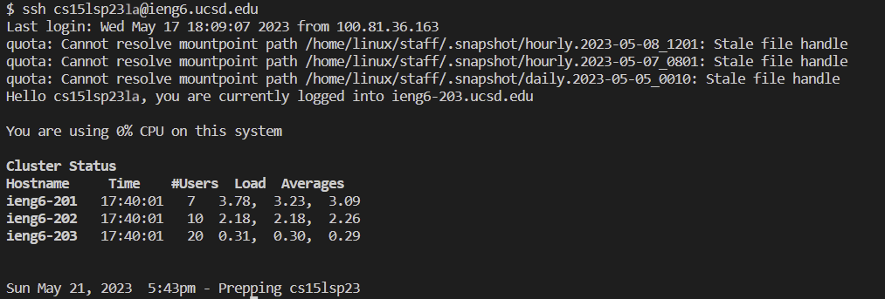
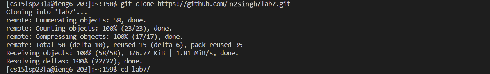
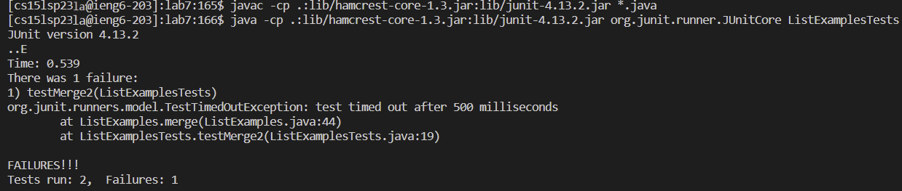
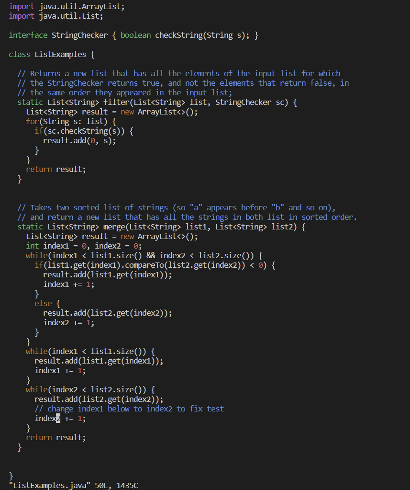
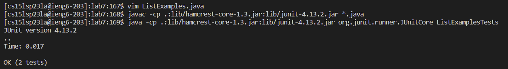
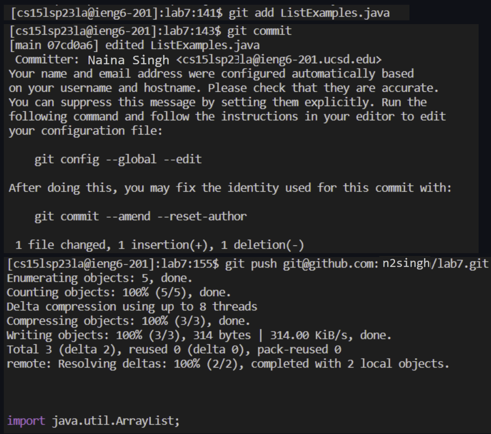

# Lab Report 4
---
For this lab we are taking the same tasks from lab and reproducing them on our own while taking screenshots and writing down all the keys pressed. (Steps 4-9)
---
## Step 1: Log into your ieng6 account
---
Keystrokes:
- `$ ssh cs15lsp23la@ieng6.ucsd.edu`
- Type in password or you don't need to if you have your SSH key set up
Screenshot:

## Step 2: Clone the fork of the repository into our own Github account
---
- git clone `<paste>` `<enter>` (I copy and pasted [Link](https://github.com/n2singh/lab7.git) from github)
- cd l `<tab>` `<enter>` this autofills to lab7 and shifted me into the lab7 directory which just got cloned.
Screenshot:

## Step 3: Run the tests and show they fail
---
Keystrokes:
- `<up><up><up><up><up><up><up><up><up><up><enter>`
- `javac -cp .:lib/hamcrest-core-1.3.jar:lib/junit-4.13.2.jar *.java`
- `<up><up><up><up><up><up><up><up><up><up><enter>`
- `java -cp .:lib/hamcrest-core-1.3.jar:lib/junit-4.13.2.jar org.junit.runner.JUnitCore ListExamplesTests`
- there was 11 spaces above in the terminal from practicing before and it compiled the files and ran the tests
Screenshot:

## Step 4: Edit the code to fix the failures
---
Keystrokes:
- vim L `<tab>`.j `<tab>` `<enter>` (autofills to 'vim ListExamples.java' and opens ListExamples.java in vim)
- /change `<enter><down><right><right>` (Searches for word change and then we navigate to the desired place)
- r2 (replaces 1 with 2)
- :wq (saves file and quits vim)
Screenshot:

(after opening the file using vim and after changing index 1 to 2 which is highlighted by cursor)
## Step 5: Run the tests to show they now pass
---
Keystrokes:
- `<up> <up> <up> <enter>(javac -cp .:lib/hamcrest-core-1.3.jar:lib/junit-4.13.2.jar *.java)`
- `<up> <up> <up> <enter>(java -cp .:lib/hamcrest-core-1.3.jar:lib/junit-4.13.2.jar org.junit.runner.JUnitCore ListExamplesTests)`
was 3 places up in the terminal; compiled the java files and ran the tests.
Screenshot:

## Step 6: Commit and push the change to your Github account
---
- git add ListExamples.java `<enter>`
- git commit `<enter>`
- i (get into insert mode for commit message)
- edited ListExamples.java
- `<esc>` :wq (exit insert mode, save and enter commit message and confirm commit)
- git push [Link](git@github.com:n2singh/lab7.git) `<enter>` (push to github)
Screenshot:

---
