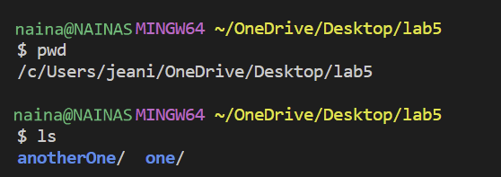
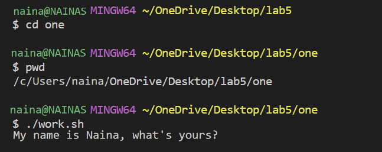
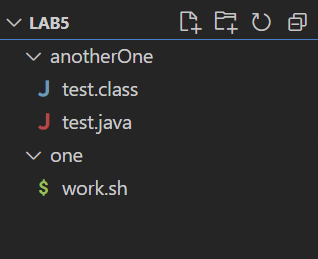

# Lab Report 5

---

## Part 1 – Debugging Scenario

*Student*

> **What environment are you using (computer, operating system, web browser, terminal/editor, and so on)?**

Terminal on VSCode 
I am in the `lab5` directory with two folders (`one` and `anotherOne`). 

`one` has a bash script called `work.sh` and `anotherOne` has a java file called `test.java`.

> **Detail the symptom you're seeing. Be specific; include both what you're seeing and what you expected to see instead. Screenshots are great, copy-pasted terminal output is also great. Avoid saying “It doesn't work”.**

I am having trouble trying to run my bash script called `work.sh`.
`work.sh` ia suppoed to run the java file I have located in `anotherOne`, 
but when I type `./work.sh` onto the terminal, I get the error 

`bash: ./work.sh: No such file or directory.`

I am trying to get my java file to run and to print out the result 

`My name is Naina, what's yours?`

Here is a picture of my error.


> **Detail the failure-inducing input and context. That might mean any or all of the command you're running, a test case, command-line arguments, working directory, even the last few commands you ran. Do your best to provide as much context as you can.**

I spelled my bash script command correctly, made sure that within my bash script, I inputted the correct java file to run. 
I'm not sure why it cannot find the file when I typed everything out correctly and the commands themself are correct. 
Can you help me with this bug? Thank you!

*TA Response*

Hi there! You can try using the command `pwd`. This shows the directory you are in. 
What does this tell you when you input this into the command line? Which directory are you currently in? 
The command `ls` is also helpful. Remember you can use `cd` to change your directory.
Try those commands out and report what you see!

*Student Response*



I tried `ls` and `pwd` and saw that I was not in the correct directory. 
Eventhough `work.sh` is in the `lab5` directory, I realized to run `work.sh` first.
I needed to `cd` into `one` inorder to run the script. 
I fixed my error by running `cd one` into the terminal, and then I ran `./work.sh`.



---

## Set-Up and Run the Scenario 
---
I created a folder called `lab5` and had two other folders within `anotherOne` and `one`. I had a bash script named `work.sh` in one and a java file named `test.java` in `anotherOne`.



contents in `test.java`

```
public class test {
    public static void main(String[] args) {
        System.out.println("My name is Naina, what's yours?");
    }
}
```

contents in `work.sh`:

```
#!/bin/bash
javac ../anotherOne/test.java
java -cp ../anotherOne test
```

To trigger the bug, I ran:  `./work.sh`


To fix the bug, I ran the following command on the terminal:

```
cd one
```

The student was not able to run the bash script because they were in the wrong directory. Instead of being in the one reletive path, the student was in the lab5 directory. 
To fix this bug, the student needed to change their directory to `one`, which is where the bash script `work.sh` is located.

---

## Part 2 – Reflection

Something I learned from my lab experience in the second half of this quarter was when we got the 2-3 lessons on Vim. It was really fun to learn about this new platform that 
wasn't VSCode for once lol. One of the main advantages of Vim is its efficiency. The editor is designed to minimize the need for mouse usage and maximize keyboard shortcuts. This allows users to perform tasks rapidly without lifting their hands off the keyboard, resulting in increased productivity. Although this is technical, I still find it really interesting and hope to experiment with Vim more now that it has been taught!
