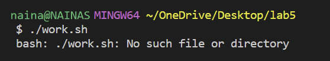

# Lab Report 5

---

## Part 1 Student Symptoms
---

*Student*

> **What environment are you using (computer, operating system, web browser, terminal/editor, and so on)?**

Terminal on VSCode 
I am in the `lab5` directory with two folders (`one` and `anotherOne`). 
`one` has a bash script called `work.sh` and `anotherOne` has a java file called `test.java`.

> **Detail the symptom you're seeing. Be specific; include both what you're seeing and what you expected to see instead. Screenshots are great, copy-pasted terminal output is also great. Avoid saying “It doesn't work”.**

I am having trouble trying to run my bash script called `work.sh`.`work.sh` ia suppoed to run the java file I have located in `anotherOne`, but when I type `./work.sh` onto the terminal, I get the error 

`bash: ./work.sh: No such file or directory.`

I am trying to get my java file to run and to print out the result 

`My name is Naina, what's yours?`

Here is a picture of my error.

> **Detail the failure-inducing input and context. That might mean any or all of the command you're running, a test case, command-line arguments, working directory, even the last few commands you ran. Do your best to provide as much context as you can.**

I spelled my bash script command correctly, made sure that within my bash script, I inputted the correct java file to run. 
I'm not sure why it cannot find the file when I typed everything out correctly and the commands themself are correct. 
Can you help me with this bug? Thank you!

*TA Response*

Hi there! You can try using the command `pwd`. This shows the directory you are in. 
What does this tell you when you input this into the command line? Which directory are you currently in? 
The command `ls` is also helpful. Remember you can use `cd` to change your directory.
Try those commands out and report what you see!

*Student Response*

